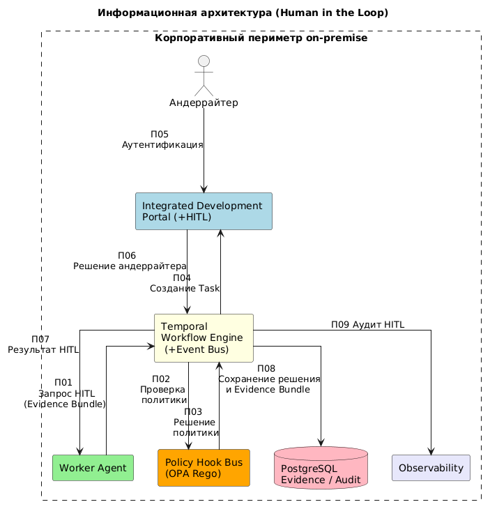
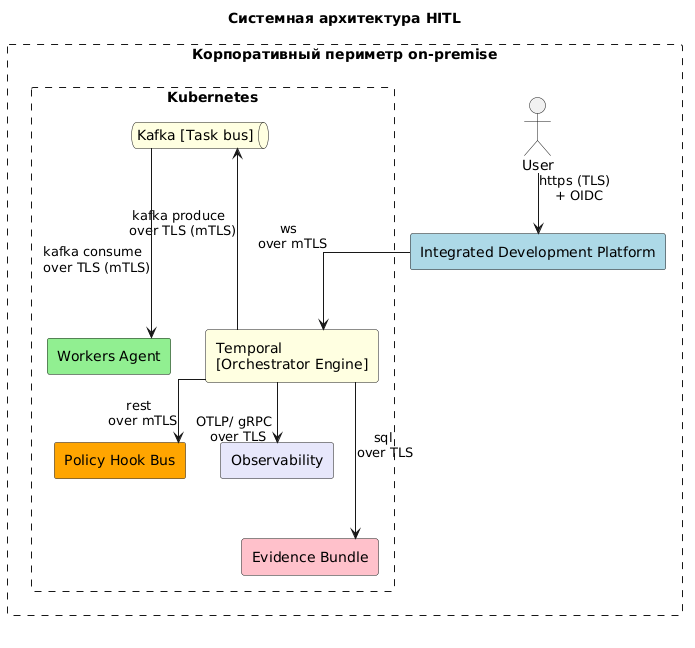

# 🏦 Архитектурное решение: Human-in-the-Loop для AI-агента кредитования МСБ

[]()
[]()
[]()
[]()
[]()

> **Enterprise архитектурное решение** механизма вовлечения человека в критические точки принятия решений AI-агентом при обработке кредитных заявок малого и среднего бизнеса.

---

## 🎯 Проблема и решение

### Проблема
AI-агенты в банковском контуре сталкиваются с дилеммой:
- ❌ **Полная автономия** → риск ошибок в критических финансовых решениях
- ❌ **Подтверждение каждого действия** → `approval fatigue`, потеря эффективности

### Решение
**Адаптивная HITL-архитектура** с риск-ориентированной лестницей автономии (R0–R5):

| Уровень | Режим | Участие человека |
|---------|-------|------------------|
| **R0–R1** | HITL (интерактивный) | Решение в реальном времени |
| **R2** | HITL (при исключении) | Разрешение аномалий |
| **R3–R4** | HITL (batch) | Пакетное согласование |
| **R5** | HOTL (автономия) | Периодический аудит (5% sampling) |

**Результат:** человек вовлекается только там, где цена ошибки высока, а низкорисковые операции согласуются пакетно.

---

## 🏗️ Ключевые архитектурные концепции

### 1. 🗺️ Decision Map
5 точек валидации с чёткими критериями эскалации:

```
Извлечение документов → Скоринг → Compliance/AML → Финальный релиз → Периодический аудит (R5)
```

Каждая точка фиксирует: **кто валидирует**, **критерии эскалации**, **что блокирует**, **эскалация при отсутствии ответа**.

### 2. 🎚️ Адаптивная R-level лестница
`Effective R = Nominal R − (Критичность + Риск + Сложность)`

Уровень автономии пересчитывается в runtime на основе триады факторов — никакого статического конфига.

### 3. 🛡️ Policy Hook Bus (OPA Rego)
Кодифицированные guardrails на языке Rego:
- `credit_approval.rego` — эскалация при сумме >5 млн ₽
- `pdn_masking.rego` — маскирование ПДН (152-ФЗ)
- `aml_check.rego` — антиобнал

**Enforcement:** `ALLOW` / `DENY` / `ESCALATE` до исполнения действия.

### 4. 📦 Evidence Bundle
Пакет доказательств завершения задачи: результаты evals, audit-лог, explanation artifact, финансовый скоринг. Контракт завершения для HITL-ревью.

### 5. ⚡ Real-time Explainability Layer
Структурированное объяснение решений AI <500ms для поддержки андеррайтера.

---

## 📁 Структура документа

```
📦 hitl-architecture/
├── 📄 README.md                          # Этот файл
├── 📊 diagrams/
│   ├── info_architecture.png     # Потоки данных
│   ├── sys-architecture.png          # Системная архитектура
└── 📋 docs/
    ├── Architecture_Document.md                   # версия АР markdown
    └── Architecture_Document.docx                 # версия АР docx
```

### Основные разделы АР

1. **Общие сведения** — глоссарий, описание, ограничения
2. **Бизнес-архитектура** — 4 сценария (R0-R1, R2, R3-R4, R5), Decision Map
3. **Архитектурное решение** — 4 варианта + обоснование выбора
4. **Информационная архитектура** — 9 потоков данных с протоколами
5. **Системная архитектура** — компонентная схема с mTLS
6. **Реализация** — требования, доработки вне зоны команды
7. **Информационная безопасность** — аутентификация, авторизация, Vault
8. **Нефункциональные требования** — нагрузка, хранение, compliance

---
### Диаграммы
Информационная диаграмма потоков


Системная диаграмма

---

## 🚀 Как использовать

### Для архитекторов
Изучите разделы **3.1** (архитектурные развилки) и **Decision Map** — это переиспользуемые паттерны для любых AI-агентных систем в регулируемых отраслях.

### Для разработчиков
Разделы **4.1** (требования к реализации) и **5.1** (ИБ) содержат конкретные технологические ограничения и контракт интеграции.

### Для продукт-менеджеров
Раздел **2.2** (сценарии R0–R5) показывает, как балансировать автономию и контроль в зависимости от критичности операции.

---

## 💡 Ключевые инсайты проекта

1. **HITL — не кнопка «Одобрить», а сквозной governance-слой**, встроенный в платформу (Embedded Governance).
2. **Адаптивная лестница R-level** эффективнее статических правил — она учитывает контекст, а не только тип задачи.
3. **Batch Approval** снижает approval fatigue в 10× (с 100+ до ≤10 подтверждений в сессии).
4. **Policy as Code (OPA Rego)** делает правила аудитуемыми и версионируемыми, в отличие от промпт-инструкций.
5. **Append-only audit с hash-chain** — обязательное требование для финансовых решений (ЦБ РФ).

---

## 👨‍💻 Автор

**Enterprise System Architect**

Специализация: архитектура AI-агентных систем в регулируемых отраслях (финтех, банкинг), enterprise-интеграции, compliance-driven design.

📧 **Email:** [litch1@yandex.ru](mailto:litch1@yandex.ru)  
💼 **Telegram:** [@ganja_iv](https://linkedin.com/in/your-profile)  
🐙 **GitHub:** [github.com/litch1-github](https://github.com/litch1-github)  

---

## 📜 Лицензия

Этот архитектурный документ распространяется под лицензией [MIT](LICENSE). Материалы доступны для повторного использования в ваших проектах.

---

<p align="center">
  <i>Сделано с ❤️ и ☕ для сообщества enterprise-архитекторов</i><br>
  <sub>⭐ Если проект был полезен — поставьте звезду, это помогает другим найти его</sub>
</p>
